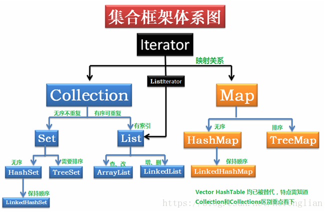
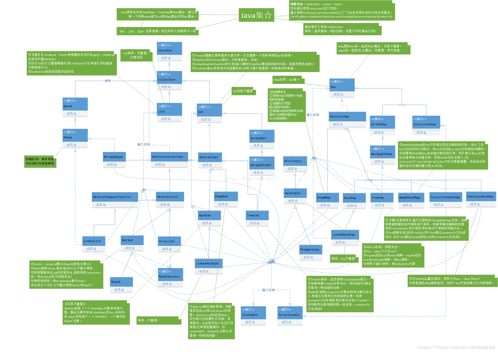

## java中集合类的关系

### array和arrays的区别,Collection和Collections的区别

Array类主要提供了动态创建和访问 Java 数组的方法。

Arrays包含用来操作数组（比如排序和搜索）的各种方法。此类还包含一个允许将数组作为列表来查看的静态工厂。

Collections是个java.util下的类，它包含有各种有关集合操作的静态方法。他提供一系列静态方法实现对各种集合的搜索、排序、线程安全化等操作。

Collection是个java.util下的接口，它是各种集合结构的父接口  继承于他的接口主要有Set 和List。

["参考一"](https://blog.csdn.net/xinshishenchao/article/details/54412065?depth_1-utm_source=distribute.pc_relevant.none-task&utm_source=distribute.pc_relevant.none-task)

java中的排序工具主要是有两个Arrays和Collections。我们一个一个来讲解。

本来写好了每一种方法的测试代码，后来又给删了，因为我觉得如果想要去了解的话，可以直接查看这些常用的即可。因为使用起来真的太简单。篇幅太长也不好。

一、Arrays

Arrays类位于 java.util 包中，主要包含了操纵数组的各种方法。

1、Array.sort(Object[] array)：

对数组按照升序排序

2、Arrays.sort(Object[] array, int from, int to)：

对数组元素指定范围进行排序（排序范围是从元素下标为from,到下标为to-1的元素进行排序

3、Arrays.fill(Object[] array,Object object)：

可以为数组元素填充相同的值

4、Arrays.fill(Object[] array,int from,int to,Object object)：

对数组的部分元素填充一个值,从起始位置到结束位置，取头不取尾

5、Arrays.toString(Object[] array)：

返回数组的字符串形式

6、Arrays.deepToString(Object[][] arrays)：

返回多维数组的字符串形式。

7、Arrays.binarySearch(Object[] array,element);

在数组array中查找element。并返回下表

二、Collections

Collections是针对集合类的一个帮助类，它提供了一系列静态方法实现了对各种集合的排序，搜索和线程安全等操作。

1.Shuffle（element）：洗牌方法，将当前集合内的数据进行随机排序。

2.Reverse（element）：逆序排序，对当前集合的元素按照相反的顺序进行排序

3.Sort（element）：对当前集合进行升序排序,实现Comparable接口的类，只能使用一种排序方案，这种方案叫作“自然比较”方案。

4.binarySearch(Collection,Object):查找指定集合中的元素，返回所查找元素的索引

5.max(Collection),max(Collection,Comparator)：

前者采用Collection内含自然比较法，后者采用Comparator进行比较

6、indexOfSubList(List list,List subList)

查找subList在list中首次出现位置的索引

7、replaceAll(List list,Object old,Object new)：

替换批定元素为某元素,若要替换的值存在刚返回true,反之返回false

8、rotate(List list,int m)：

集合中的元素向后移m个位置，在后面被遮盖的元素循环到前面来

9、copy(List m,List n)：

将集合n中的元素全部复制到m中,并且覆盖相应索引的元素
["参考二"](https://baijiahao.baidu.com/s?id=1651514735396111576&wfr=spider&for=pc)

参考：
https://blog.csdn.net/junior8289/article/details/50358404
https://www.dazhuanlan.com/2019/08/26/5d62c8efa491a/
https://www.cnblogs.com/cathyqq/p/5279859.html
https://www.jianshu.com/p/dc1090b53ea1
https://blog.csdn.net/hefenglian/article/details/82596453 